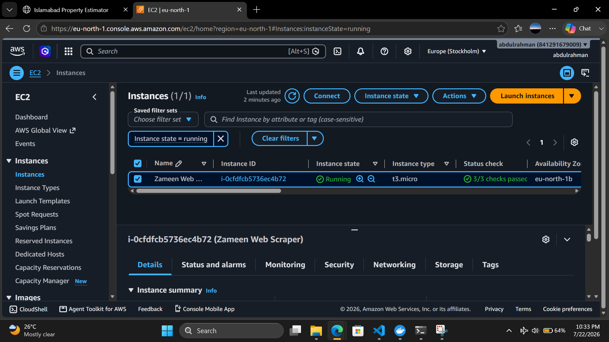
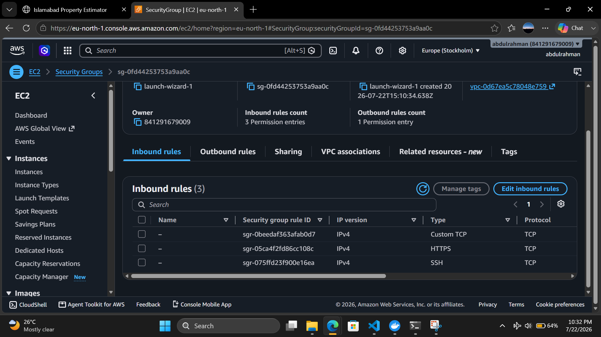
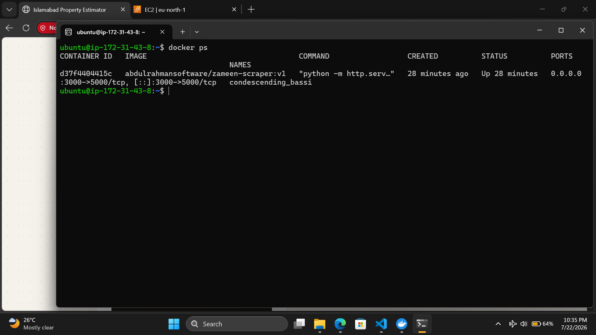
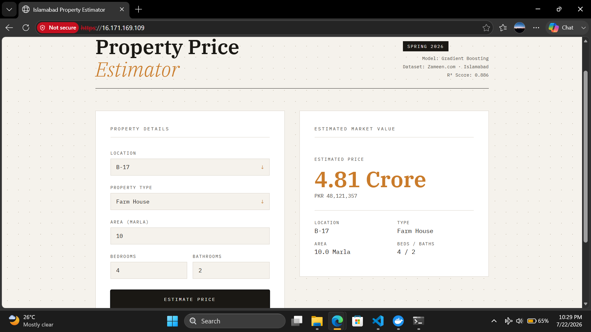

# Zameen.com Property Scraper & Price Estimator — AWS Deployment

A containerized web scraper and machine learning price estimator for Islamabad real estate, deployed on AWS EC2 with a secured HTTPS endpoint.

## Overview

This project demonstrates a full deployment pipeline: scraping property listings, training a price prediction model, containerizing the application with Docker, pushing it to Docker Hub, and deploying it on a public-facing AWS EC2 instance secured with an HTTPS reverse proxy.

**Live demo:** `https://<ec2-public-ip>` *(self-signed certificate — browser will show a security warning; click "Advanced" → "Proceed" to view)*

## Tech Stack

- **Scraping:** Python, Playwright, BeautifulSoup-style selectors
- **ML Model:** scikit-learn Gradient Boosting Regressor (R² = 0.886), trained on Zameen.com Islamabad listings
- **Frontend:** PyScript (Pyodide) running the trained model directly in-browser — no backend inference server required
- **Containerization:** Docker
- **Registry:** Docker Hub
- **Cloud:** AWS EC2 (Ubuntu 24.04, t3.micro)
- **Reverse proxy / TLS:** Nginx with a self-signed SSL certificate

## Architecture

```
Zameen.com  →  Playwright Scraper  →  islamabad_properties.csv
                                            ↓
                                  Data Preprocessing + Model Training
                                            ↓
                                     model_data.json (serialized tree model)
                                            ↓
                          Docker Image (Python http.server + static files)
                                            ↓
                              Docker Hub (abdulrahmansoftware/zameen-scraper)
                                            ↓
                    AWS EC2 (Ubuntu, Docker) → docker run -p 3000:5000
                                            ↓
                         Nginx reverse proxy (443 → 3000) + self-signed TLS
                                            ↓
                              Public HTTPS endpoint (browser)
```

## Deployment Steps

1. **Build & tag the Docker image locally**
   ```bash
   docker build -t abdulrahmansoftware/zameen-scraper:v1 .
   ```

2. **Push to Docker Hub**
   ```bash
   docker login
   docker push abdulrahmansoftware/zameen-scraper:v1
   ```

3. **Launch an EC2 instance** (Ubuntu 24.04, t3.micro) and configure a security group allowing inbound TCP on:
   - Port 22 (SSH, restricted to my IP)
   - Port 3000 (app, for testing)
   - Port 443 (HTTPS, public)

4. **SSH into the instance, install Docker, and pull/run the image**
   ```bash
   docker pull abdulrahmansoftware/zameen-scraper:v1
   docker run -d -p 3000:5000 abdulrahmansoftware/zameen-scraper:v1
   ```

5. **Install and configure Nginx as a TLS-terminating reverse proxy**
   ```bash
   sudo apt install -y nginx
   sudo openssl req -x509 -nodes -days 365 -newkey rsa:2048 \
     -keyout /etc/nginx/ssl/selfsigned.key \
     -out /etc/nginx/ssl/selfsigned.crt \
     -subj "/CN=<ec2-public-ip>"
   ```
   Nginx config (`/etc/nginx/sites-available/myapp`):
   ```nginx
   server {
       listen 443 ssl;
       server_name <ec2-public-ip>;

       ssl_certificate /etc/nginx/ssl/selfsigned.crt;
       ssl_certificate_key /etc/nginx/ssl/selfsigned.key;

       location / {
           proxy_pass http://localhost:3000;
           proxy_set_header Host $host;
       }
   }
   ```
   ```bash
   sudo ln -s /etc/nginx/sites-available/myapp /etc/nginx/sites-enabled/
   sudo nginx -t
   sudo systemctl restart nginx
   ```

## Why HTTPS?

The frontend uses PyScript, which relies on browser APIs (`crypto.randomUUID`) that are only available in a "secure context" (HTTPS or localhost). Serving the app over plain HTTP on a public IP caused the app to fail silently in the browser. Adding an Nginx reverse proxy with TLS termination resolved this and is representative of how production deployments handle browser security requirements.

## Screenshots

### EC2 instance running
t3.micro instance in `eu-north-1`, status checks passed.



### Security group inbound rules
SSH (restricted), custom TCP on 3000, and HTTPS on 443.



### Container running on EC2
`docker ps` output showing the app container port-mapped from 3000 → 5000.



### Live app served over HTTPS
The estimator running on the public EC2 IP behind the Nginx TLS reverse proxy.



## Known Limitations

- Uses a self-signed TLS certificate since the deployment targets a raw IP address rather than a registered domain. A production setup would use a domain name with a Let's Encrypt certificate for a trusted connection (no browser warning).
- The EC2 instance is intentionally left running only for demo purposes and is stopped when not in active use to stay within AWS free-tier limits.

## Project Structure

```
.
├── scraper.py                 # Playwright-based scraper for Zameen.com listings
├── data_preprocessing.py      # Cleans and encodes scraped data
├── model_training.py          # Trains and serializes the Gradient Boosting model
├── model_data.json            # Serialized model (used directly in-browser)
├── index.html                 # Frontend UI
├── inference.py                # PyScript inference logic (runs in-browser)
├── Dockerfile
└── requirements.txt
```